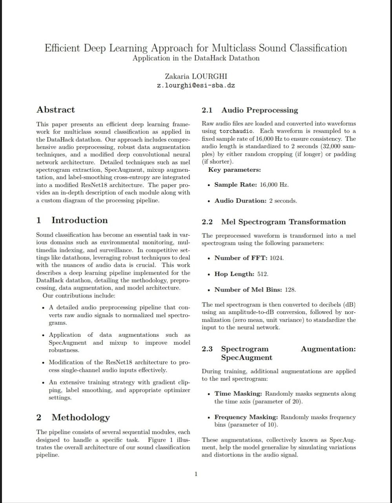

# Efficient Deep Learning Approach for Multiclass Sound Classification

This repository contains the research paper **'Efficient Deep Learning Approach for Multiclass Sound Classification'**, which presents a deep learning framework for robust sound classification. The paper details advanced audio preprocessing techniques, data augmentation strategies, and a modified ResNet18 architecture tailored for this task.

## Read the Full Paper
To explore the methodology and results in detail, read the full paper here: [paper.pdf](multiclass_sound_classification_paper.pdf).


## Abstract
This paper introduces an efficient deep learning pipeline for multiclass sound classification, developed for the DataHack datathon. The approach integrates advanced audio preprocessing, SpecAugment-based data augmentation, mixup regularization, and a modified ResNet18 neural network. Each component of the pipeline is carefully designed to enhance classification performance, with an in-depth explanation provided in the paper. The document also includes a custom pipeline diagram illustrating the complete workflow.

## Why Read This Paper?
- **Comprehensive Audio Preprocessing**: Standardizing raw audio through resampling, padding/cropping, and mel spectrogram extraction.
- **Advanced Data Augmentation**: Techniques such as SpecAugment and mixup to improve model generalization.
- **Optimized Neural Network Architecture**: A modified ResNet18 designed for single-channel audio input.
- **Robust Training Strategy**: Incorporating label smoothing, gradient clipping, and the AdamW optimizer for stable learning.

## Pipeline Overview
The research paper includes a detailed pipeline diagram illustrating the step-by-step methodology:


## Repository Structure
```
multiclass-sound-classification-ResNet/
├── multiclass_sound_classification_paper.pdf      # The compiled research paper
├── README.md      # Project documentation and paper link
├── LICENSE        # The MIT license
├── first_page.jpg   # The first page of the paper
└── script.ipynb    # The Jupyter Notebook used to produce the results
```

## How to View the Paper
1. Click on the link above to view the PDF directly in your browser.
2. Alternatively, download the PDF to your local machine for offline viewing.

## Citation
If you find this work useful, please cite it as:
```
@article{soundclassification2023,
  title={Efficient Deep Learning Approach for Multiclass Sound Classification},
  author={Zakaria LOURGHI},
  year={2025},
  journal={GitHub Repository},
  url={https://github.com/ZakLr/multiclass-sound-classification-ResNet}
}
```

## License
This project is licensed under the MIT License. See the [LICENSE](LICENSE) file for details.
